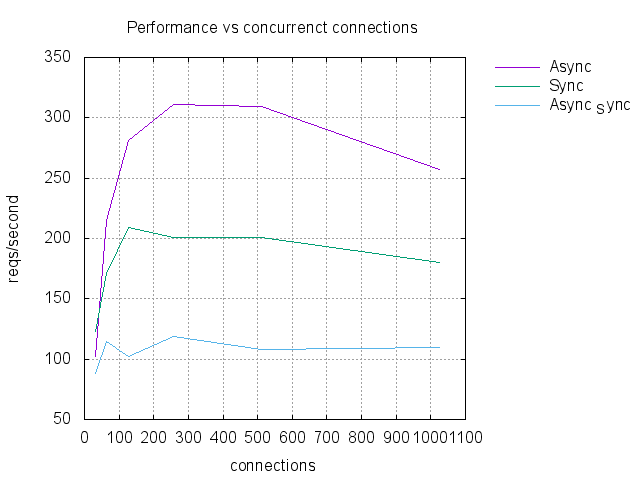

Content
=======

* Futures and Threads
* Synchronous Currency converter made asynchronous
* The Flask implementation
* Comparing the three implementations

----

Futures and Threads
===================

Remember about the `Futures`, its a way to synchronize Producers and Consumers.

.. code-block:: python 
    
    async def poll(buffer):
        correlation_id, data = parse_buffer(buffer)
        future.pop(correlation_id).set_result(data)

    async def some_operation(request):
        f = Future()
        correlation_id = uuid()
        futures.append(f)
        send_noneblocking(pack(correlation_id, request))
        return f

    result = await some_opeation(request)

----

Futures and Threads
===================

Asyncio implements a way to wrap threads executors in a Future.

.. code-block:: python 

    def bar():
        return 10

    async def foo()
        executor = ThreadPoolExecutor()
        await asyncio.get_event_loop().run_in_executor(executor, bar)

    result = await foo()

----

Futures and Threads
===================

This is a way, the easy one, to wrap synchronous code and execute it
asynchronoysly. Also a proper way to run CPU bound functions.

----

Time for coding
===============

Prepare your enviornment

.. code-block:: bash

    $ git checkout part2
    $ pip install -r requirements.txt

----

Synchronous Currency converter made asynchronous
================================================

Implement a HTTP server that exposes the currency converter synchronous 
wraped to be executed asynchronoysly.

What do we expect ?

.. code-block:: bash

    $ python webserver_forceasync.py &
    $ curl http://localhost:8080/convert/GBP/100
    GBP 88.4

----

Synchronous Currency converter made asynchronous
================================================

- Use the template behind the path `webserver_forceasync.py`
- More info about `threadpoolexecutor <https://docs.python.org/3/library/concurrent.futures.html>`_ and `run_in_executor <https://docs.python.org/3/library/asyncio-eventloop.html#asyncio.AbstractEventLoop.run_in_executor>`_

----

Synchronous Currency converter made asynchronous
================================================

You have **10 minutes**. Just fill the code gaps, have fun!

----

Move on to the last part
========================

Prepare your enviornment

.. code-block:: bash

    $ git checkout part3
    $ pip install -r requirements.txt
----

The Flask implementation
========================

A pure synhcronous code

.. code-block:: python 

    @app.route("/convert/<currency>/<amount>")
    def convert(currency, amount):
        client = CurrencyClient()
        amount_converted = client.convert(currency, int(amount))
        return "{} {}".format(currency, str(amount_converted))

    if __name__ == '__main__':
        app.run(host='0.0.0.0', port=8080, threaded=True)

----

The Flask implementation
========================

Try it

.. code-block:: bash

    $ python webserver_flask.py &
    $ curl http://localhost:8080/convert/GBP/100
    GBP 88.4

----

Comparing the three implementations
===================================

- `webserver.py` pure asynchronous code
- `webserver_forceasync.py` synchronous code wrapped
- `webserver_flask.py` pure synchronous code 

----

Time for benchmarking
=====================

We will use `wrk <https://github.com/wg/wrk>`_, how to install ?

- Mac : ``brew install wrk``
- Ubuntu : ``apt-get install wrk``
- Windows ... does not work

----

Example of test 
===============

.. code-block:: bash

    $ python webserver_flask.py > /dev/null 2>&1 &
    $ webserver_pid=$!
    $ wrk -t100 -c100 http://localhost:8080/convert/GBP/100
    .... some data omitted ....
    Requests/sec:    205.81

    $ kill $webserver_pid

----

Results 
=======

Lets do it for all of our implementations, share the results!

If you wanna change the number of threads/connections feel free, but for
the sake of clarity I would keep the same cardinality.

----

Comparing the three implementations 
===================================

----

The End 
=======

Questions ? Someting that you wanna share ?

----

